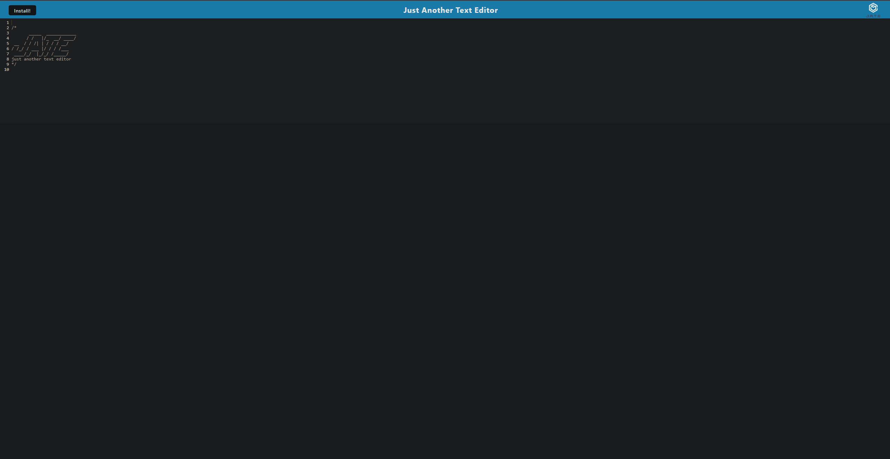
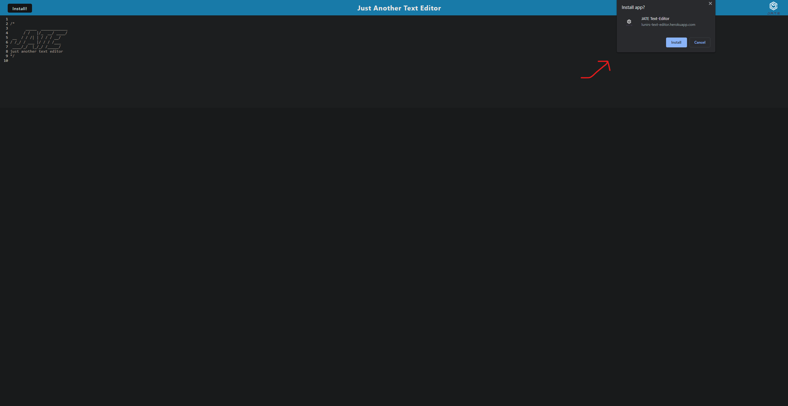
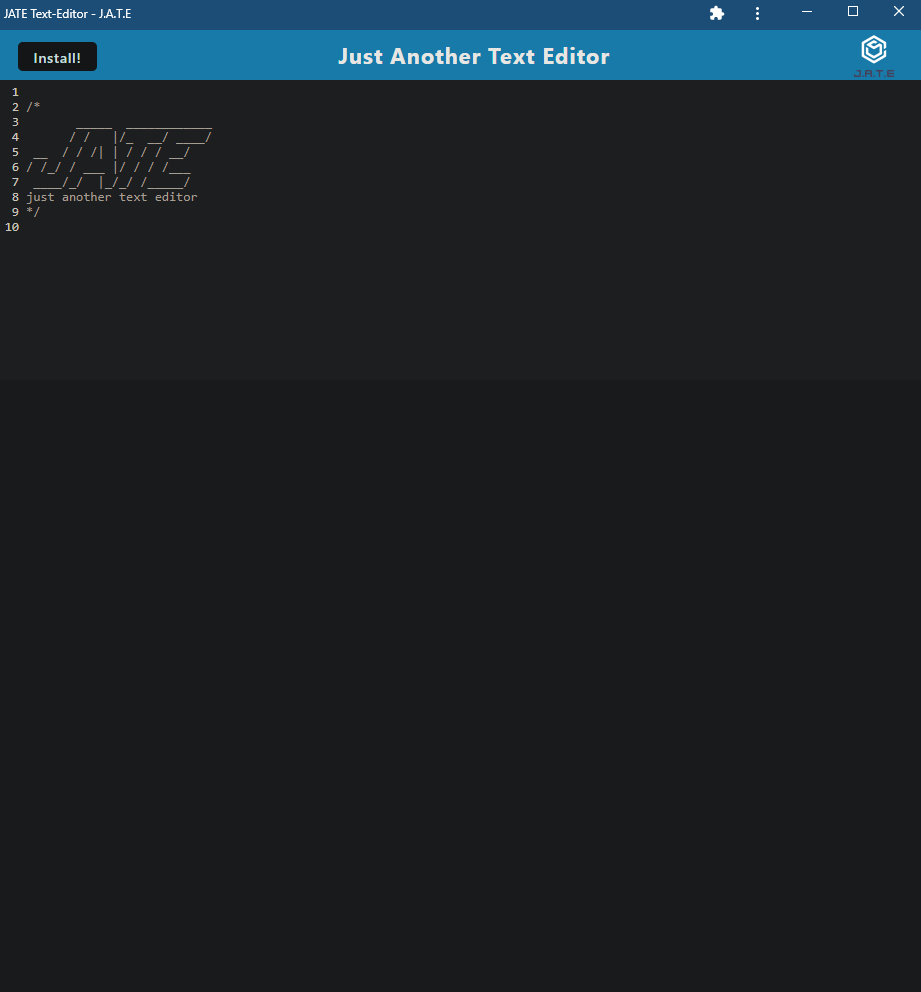

# Text-Editor


## Description

JATE (Just Another Text Editor) is a single-page text editor that you can run in your browser. It utilizes IndexedDB and as well as local storage. This single-page text editor can be utilized offline and can also be downloaded from the web page by clicking on the install button.

This application was deployed onto heroku. If you would like to utilize this app, please head over to the link below!

### Deployed Link https://lunirs-text-editor.herokuapp.com/

## Table of Contents

1. [Installation](#installation)
2. [Usage](#usage)
3. [Questions](#questions)
4. [License](#license)

## Installation

In order to use this application after cloning it down, you would need to run the following code block,

```
npm i
```

When you run npm i in the root folder of the project, node will utilize the script and download all of the npm packages needed to run the entire application by cding into other directories to install their packages.

Once you have finalized the installation, you will be able to run the following code block to start up your server.

```
npm start
```

## Usage

Once you have fully set up the repository, you will be able to use the text-editor!

Please see the screenshots below to see the functionality.

### JATE initial page



### JATE Clicking on Install Button



### JATE Application view



## Questions

If you have any questions, please feel free to reach out to me via:

1. Email: dhong0925@gmail.com
2. GitHub: Lunirs

## License

Licensed under the MIT license.

## Credits

Copyright © Daniel Hong All rights reserved.
